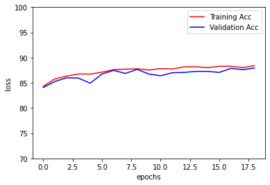
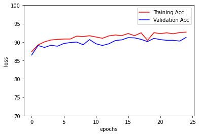
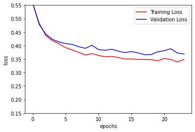
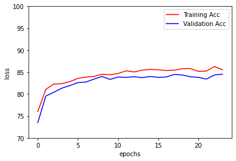
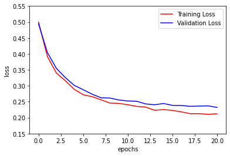
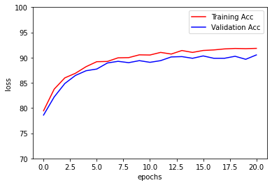

# MSCS19003_COVID19_DLSpring2020
This repository contains code and results for COVID-19 classification assignment by Deep Learning Spring 2020 course offered at Information Technology University, Lahore, Pakistan. 
This assignment is only for learning purposes and is not intended to be used for clinical purposes.

# Dataset
[Dataset Folder](https://drive.google.com/drive/u/1/folders/1-FzZhQO9oHIT9SNOWYoKsuz7fe447vtR)

[Dataset zip file](https://drive.google.com/file/d/1-HQQciKYfwAO3oH7ci6zhg45DduvkpnK/view)

# Weights (trained models)

**VGG16 (FC layers only)** : [vgg16_FC_Only](https://drive.google.com/file/d/1gfmvWBnmoJCTUXZZHS5ldtgmbCacPd8h/view?usp=sharing)

**VGG16 (entire network)** : [vgg16_entire](https://drive.google.com/file/d/1D2_7JlMQf3UVSMgyqJw1mAsDq1aC1reo/view?usp=sharing)

**ResNet18 (FC layers only)** : [res18_FC_Only](https://drive.google.com/file/d/1LX3uqye6nLtGWxF_qZAz6pSlf4Ufki1z/view?usp=sharing)

**ResNet18 (entire network)** : [res18_entire](https://drive.google.com/file/d/1yTxzCfUYlKAVWKsJZ6uJdPKImp1MRiZx/view?usp=sharing)

# Results

## Accuracy Table
Sr # | Backbone| layers |epochs | Train  | Validation  | Test
---|---|---|---|---|---|---
1 | VGG16 | Only FC layers are unfrozen | 18 | 88.83 | 87.93 | 93.93
2 | Resnet18 | Only FC layers are unfrozen | 23 | 85.81 | 84.53 | 90.87
3 | VGG16 | Conv1, Conv2, Conv3 are frozen | 23 | 91.84 | 91.40 | 96.27
4 | VGG16 | Conv1, Conv2 are frozen | 13 | 90.83 | 91.07 | 96.53
5 | VGG16 | Entire network is unfrozen | 24 | 93.05 | 91.27 | 96.87
6 | Resnet18 | Layer 1,  Layer 2, Layer 3 are frozen | 22 | 90.07 | 88.67 | 94.73
7 | Resnet18 | Layer 1 is frozen | 16 | 91.21 | 90.33 | 95.60
8 | Resnet18 | Entire network is unfrozen | 20 | 90.81 | 90.53 | 96.33 

## F1-Score Table
Sr # | Backbone | Layers | epochs | Train  | Validation  | Test
---|---|---|---|---|---|---
1 | VGG16 | Only FC layers are unfrozen | 18 | 0.91 | 0.90 | 0.95
2 | Resnet18 | Only FC layers are unfrozen | 23 | 0.88 | 0.87 | 0.92
3 | VGG16 | Conv1, Conv2, Conv3 are frozen | 23 | 0.93 | 0.93 | 0.97
4 | VGG16 | Conv1, Conv2 are frozen | 13 | 0.92 | 0.92 | 0.97
5 | VGG16 | Entire network is unfrozen | 24 | 0.94 | 0.93 | 0.97
6 | Resnet18 | Layer 1,  Layer 2, Layer 3 are frozen | 22 | 0.92 | 0.90 | 0.96
7 | Resnet18 | Layer 1 is frozen | 16 | 0.93 | 0.92 | 0.96
8 | Resnet18 | Entire network is unfrozen | 20 | 0.93 | 0.92 | 0.97

## Loss and Accuracy Curves:
### VGG16 FC Layers Only:
**Loss Curve with respect to epochs**

**Accuracy Curve with respect to epochs**

### VGG16 entire Network
**Loss Curve with respect to epochs**

**Accuracy Curve with respect to epochs**

### ResNet18 FC Layers Only
**Loss Curve with respect to epochs**

**Accuracy Curve with respect to epochs**

### ResNet18 Entire Network
**Loss Curve with respect to epochs**

**Accuracy Curve with respect to epochs**

